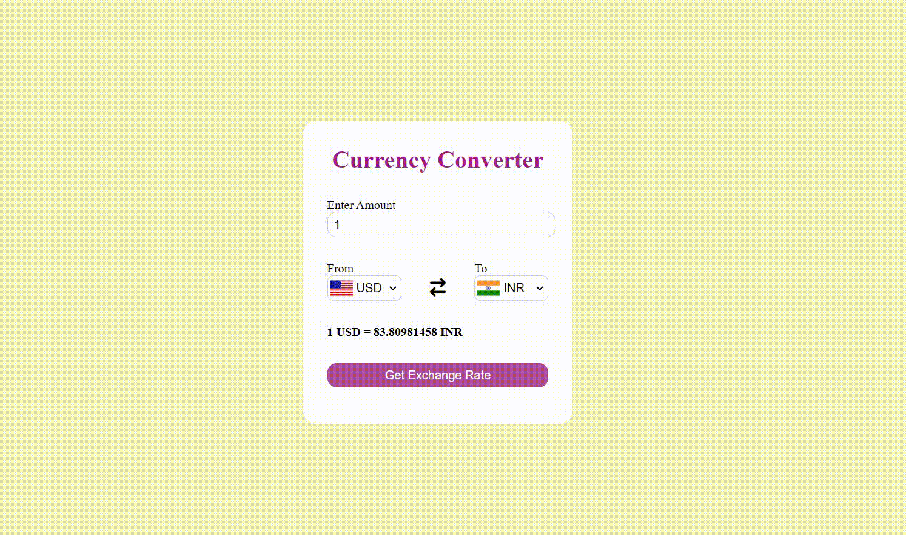

<h2 align ="center">Currency Converter</h2>
Online Platform where currency values can be easily converted based on current exchange rates. It involves calculating the exchange rate between two currencies, which represents the value of one currency in terms of another.   

<h2>Project Demo:</h2>

<table>
        <tr> 
        <td></td>
        </tr>
</table>

<h2>Technology:</h2>

- [x] **Frontend:** HTML, CSS
- [x] **Backend:** JavaScript 

<h2>Important Concepts Implemented:</h2>

* JavaScript DOM concepts
* Concept of Promises like async-await
* Strings concepts
* Fetch API
